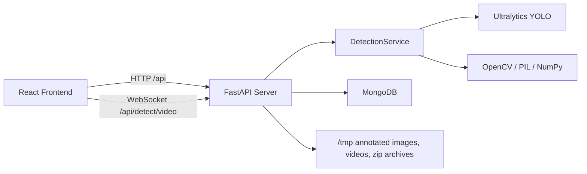

# Deplyze Studio

<p align="center">
  Open-source computer vision workspace for object and logo detection across images, video files, live camera streams, and batch uploads.
</p>

<p align="center">
  
  
  
  
  
  
  
</p>

## Overview

Deplyze Studio is a full-stack computer vision application built around a FastAPI backend and a React frontend. It provides an interactive interface for running object detection on:

- Single images
- Multiple images in batch
- Uploaded video files
- Live webcam frames over WebSocket
- Custom YOLO model uploads and runtime model switching

The backend performs inference with Ultralytics YOLO on CPU, annotates detections, stores processing history in MongoDB, and exposes download endpoints for generated assets. The frontend presents those capabilities through a tabbed dashboard with upload, preview, analytics, and download flows.

## Key Features

- Single-image detection with annotated image download
- Real-time camera detection using WebSockets
- Video file processing with processed video export
- Batch image processing with ZIP export of annotated results
- Model inspection, confidence tuning, and runtime model switching
- Custom YOLO model upload support for `.pt` and `.onnx`
- Detection and video-processing history persisted in MongoDB

## Architecture



## How It Works

### Frontend

The frontend lives in `frontend/` and is built with React 19, CRACO, Tailwind CSS, Radix UI primitives, and Axios.

It exposes four main user flows:

1. `Single Image`
   Upload an image, call detection endpoints, render object metadata, and show the annotated result.
2. `Batch Processing`
   Upload multiple images, submit them to the batch endpoint, and download a ZIP of annotated outputs.
3. `Video Processing`
   Upload a video for offline processing or use the webcam for live frame-by-frame detection.
4. `Model Management`
   Inspect the active YOLO model, switch between loaded models, and upload custom weights.

### Backend

The backend lives in `backend/` and is built with FastAPI. It:

- Initializes a `LogoDetectionService`
- Loads a default `yolo11n.pt` model at startup
- Exposes REST endpoints for image, batch, video, model, and history workflows
- Exposes a WebSocket endpoint for live video detection
- Stores metadata in MongoDB
- Saves generated files temporarily under `/tmp`

### ML Service

`backend/ml_service.py` is the core inference layer. It:

- Loads and manages multiple YOLO models
- Forces CPU inference
- Performs image, frame, batch, and video processing
- Draws bounding boxes and confidence labels with OpenCV
- Returns structured detection metadata, summary statistics, and annotated outputs

## Tech Stack

### Backend

- Python
- FastAPI
- Uvicorn
- Ultralytics YOLO
- PyTorch
- OpenCV
- Pillow
- NumPy
- Motor / PyMongo
- MongoDB
- WebSockets

### Frontend

- React 19
- CRACO
- Tailwind CSS
- Radix UI
- Lucide React
- Axios
- Sonner

### Tooling and Testing

- Pytest
- Black
- Flake8
- Isort
- Custom API test scripts: `backend_test.py`, `backend_test_extended.py`

## Getting Started

### Prerequisites

- Python 3.11 or 3.12
- Node.js 18+
- [uv](https://docs.astral.sh/uv/)
- MongoDB instance

### Environment Variables

#### Backend

Create `backend/.env`:

```env
MONGO_URL=mongodb://localhost:27017
DB_NAME=deplyze_studio
CORS_ORIGINS=http://localhost:3000,http://localhost:3001
```

#### Frontend

Create `frontend/.env`:

```env
REACT_APP_BACKEND_URL=http://localhost:8000
```

### Run the Backend

```bash
cd backend
uv venv --python 3.11
```

Activate the virtual environment:

- Windows PowerShell: `.\.venv\Scripts\Activate.ps1`
- macOS/Linux: `source .venv/bin/activate`

Install dependencies and start the API:

```bash
uv pip install -r requirements.txt
uv run uvicorn server:app --host 0.0.0.0 --port 8000 --reload
```

Why `uv`:

- It avoids the Python 3.14 package build issues that can appear with this dependency set.
- The backend has been verified locally with `uv` and Python 3.11.

### Run the Frontend

```bash
cd frontend
corepack yarn install
corepack yarn start
```

If you prefer npm:

```bash
npm install
npm start
```

If you want to force CRA to use port `3000` explicitly:

```powershell
$env:PORT=3000
corepack yarn start
```

The frontend is expected to run at `http://localhost:3000`.

### Typical Development Flow

1. Start MongoDB
2. Start the FastAPI backend on `http://localhost:8000`
3. Start the React frontend on `http://localhost:3000`
4. Open the app in the browser
5. Upload an image, video, batch set, or custom model

## Notes and Operational Behavior

- The backend loads `backend/yolo11n.pt` as the default model.
- Inference is explicitly configured for CPU execution.
- Generated annotated images, processed videos, and batch archives are stored temporarily under `/tmp`.
- Detection history and status records are saved in MongoDB.
- The frontend depends on `REACT_APP_BACKEND_URL` for both HTTP and WebSocket connectivity.
- Local development CORS is configured to accept `localhost` and `127.0.0.1` origins, including ports `3000` and `3001`.
- The frontend dev setup includes an explicit HMR plugin fix in `frontend/craco.config.js` so the app starts cleanly in development.

## Testing

You can run the included backend test scripts from the repository root:

```bash
python backend_test.py
python backend_test_extended.py
```

These scripts exercise the API endpoints for:

- Health and model info
- Image detection
- Annotated image responses
- Confidence updates
- Detection history
- WebSocket video detection
- Batch processing
- Video processing
- Download endpoints

## Contributing

Contributions are welcome.

1. Fork the repository
2. Create a feature branch
3. Make focused, well-documented changes
4. Run relevant tests before submitting
5. Open a pull request with a clear summary of the problem and solution

When contributing, please keep changes aligned with the current architecture:

- Backend inference and API logic in `backend/`
- Frontend UI and interaction flows in `frontend/`
- Project-level tests and validation scripts at the repository root

## License

This project is licensed under the MIT License. See [LICENSE](./LICENSE) for details.
